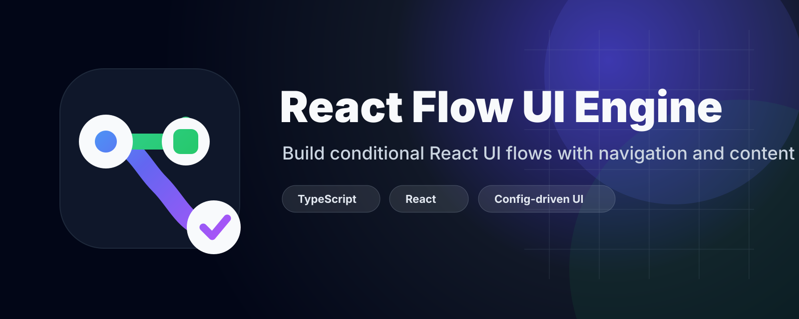
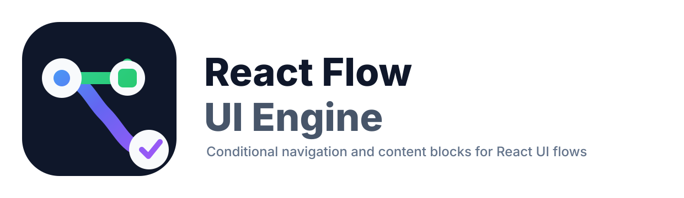

<p align="center">
  
</p>

<p align="center">
  Build onboarding, checkout, and multi-step flows with declarative logic instead of scattered UI state.
</p>

<p align="center">
  <a href="https://www.npmjs.com/package/@react-flow-ui-engine/core"></a>
  <a href="https://www.npmjs.com/package/@react-flow-ui-engine/react"></a>
  <a href="./LICENSE"></a>
  
</p>

---

Use it for onboarding, checkout, setup wizards, KYC flows, multi-step forms, conditional screens, and role-gated user journeys.

```tsx
<FlowProvider flow={signupFlow}>
  <FlowRenderer />
</FlowProvider>
```

---

## Why?

React Router and Context can handle navigation, but complex product flows often become scattered across many components:

```tsx
if (plan === 'business' && country === 'AU' && user.role === 'admin') {
  navigate('/business/au/admin')
}
```

`react-flow-ui-engine` centralizes those rules:

```ts
on: {
  SELECT_PLAN: [
    { when: (ctx, event) => event.plan === 'business', goTo: 'businessDetails' },
    { goTo: 'personalDetails' }
  ]
}
```

Your components stay focused on UI. Your flow definition owns the journey.

---

## Packages

| Package | Purpose |
|---|---|
| `@react-flow-ui-engine/core` | Framework-agnostic flow engine, validators, permissions, transitions |
| `@react-flow-ui-engine/react` | React provider, hook, renderer, nested and parallel flow rendering |

This v1 release focuses on the core flow engine and React rendering primitives.

---

## Installation

```bash
npm install @react-flow-ui-engine/core @react-flow-ui-engine/react
```

or:

```bash
pnpm add @react-flow-ui-engine/core @react-flow-ui-engine/react
```

---

## Quick Start

```tsx
import { defineFlow } from '@react-flow-ui-engine/core'
import { FlowProvider, FlowRenderer, type FlowPageProps } from '@react-flow-ui-engine/react'

type SignupContext = {
  accountType?: 'business' | 'personal'
}

function SelectAccountType({ flow }: FlowPageProps<SignupContext>) {
  return (
    <div>
      <h1>Select account type</h1>
      <button onClick={() => flow.send({ type: 'SELECT', value: 'business' })}>Business</button>
      <button onClick={() => flow.send({ type: 'SELECT', value: 'personal' })}>Personal</button>
    </div>
  )
}

function BusinessDetails({ flow }: FlowPageProps<SignupContext>) {
  return <button onClick={() => flow.back()}>Back from business</button>
}

function PersonalDetails({ flow }: FlowPageProps<SignupContext>) {
  return <button onClick={() => flow.back()}>Back from personal</button>
}

const signupFlow = defineFlow<SignupContext>({
  id: 'signup',
  initial: 'selectType',
  context: {},
  steps: {
    selectType: {
      component: SelectAccountType,
      on: {
        SELECT: [
          {
            when: (_ctx, event) => event.value === 'business',
            set: (_ctx, event) => ({ accountType: event.value }),
            goTo: 'businessDetails',
          },
          {
            when: (_ctx, event) => event.value === 'personal',
            set: (_ctx, event) => ({ accountType: event.value }),
            goTo: 'personalDetails',
          },
        ],
      },
    },
    businessDetails: { component: BusinessDetails, back: 'selectType' },
    personalDetails: { component: PersonalDetails, back: 'selectType' },
  },
})

export default function App() {
  return (
    <FlowProvider flow={signupFlow}>
      <FlowRenderer />
    </FlowProvider>
  )
}
```

---

## Core Concepts

| Concept | Meaning |
|---|---|
| Flow | A complete user journey |
| Step | A page/screen/state in the journey |
| Content block | Same-screen content that can be conditionally shown with `visibleIf`; React blocks can also provide `component` |
| Context | Shared flow data used by later steps and rules |
| Event | Something a component sends to the engine, for example `SELECT_PLAN` |
| Transition | A rule that handles an event and optionally updates context/navigates |
| Guard | A `when` function that decides if a transition should run |
| Permission | Role/permission rule for a step or transition |
| Validator | Function that blocks transition when data is invalid |

---

## React API

### `FlowProvider`

```tsx
<FlowProvider flow={flow} options={options}>
  <FlowRenderer />
</FlowProvider>
```

| Prop | Type | Description |
|---|---|---|
| `flow` | `FlowDefinition<TContext>` | Flow definition to run |
| `engine` | `FlowEngine<TContext>` | Optional pre-created engine |
| `options` | `FlowEngineOptions<TContext>` | User, unauthorized step, event callbacks |
| `children` | `ReactNode` | UI rendered inside the provider |

### `FlowRenderer`

```tsx
<FlowRenderer />
```

Renders the component for the current step. It also supports nested and parallel flows.

### `useFlow`

```tsx
const flow = useFlow<MyContext>()
```

| Property / Method | Description |
|---|---|
| `flow.state` | Full engine state |
| `flow.context` | Current flow context |
| `flow.currentStepId` | Current step id |
| `flow.currentStep` | Current step definition |
| `flow.content` | Current step content with conditional blocks filtered |
| `flow.visibleContentBlocks` | Visible same-screen content blocks for the current context |
| `<FlowContentBlocks />` | React helper that renders component blocks and optionally falls back to `renderBlock` |
| `flow.canGoBack` | Whether back navigation is available |
| `flow.send(event)` | Send an event to the active step |
| `flow.goTo(stepId)` | Navigate directly |
| `flow.next(patch?)` | Go to the current step's `next` target |
| `flow.back()` | Go back to explicit `back` or history |
| `flow.setContext(patch)` | Merge shared context |
| `flow.reset()` | Reset to initial step/context |

---

## Core API

### `defineFlow(flow)`

Validates and returns a flow definition.

```ts
const flow = defineFlow({
  id: 'checkout',
  initial: 'cart',
  context: {},
  steps: {},
})
```

### `createFlowEngine(flow, options?)`

Use this directly outside React, or when you want full control.

```ts
const engine = createFlowEngine(flow)
engine.subscribe((state) => console.log(state))
await engine.send({ type: 'NEXT' })
```

### Engine options

| Option | Description |
|---|---|
| `user` | User roles/permissions for permission checks |
| `unauthorizedStep` | Global fallback when access is blocked |
| `onStepChange` | Callback when step changes |
| `onEvent` | Callback for engine lifecycle events |

---

## Flow Definition API

```ts
const flow = defineFlow({
  id: 'my-flow',
  initial: 'start',
  context: {},
  steps: {
    start: {
      component: StartPage,
      content: { title: 'Welcome' },
      next: 'details',
      back: 'intro',
      visibleIf: (ctx) => true,
      permissions: { roles: ['admin'] },
      validate: required('name'),
      beforeEnter: async (ctx) => {},
      beforeLeave: async (ctx) => {},
      on: {
        SUBMIT: [
          {
            when: (ctx, event) => true,
            set: (ctx, event) => ({ name: event.name }),
            action: async (ctx, event) => ({ saved: true }),
            goTo: 'summary',
          },
        ],
      },
    },
  },
})
```

| Step property | Description |
|---|---|
| `component` | React component rendered by `FlowRenderer` |
| `content` | Static content passed to the component. Supports conditional `blocks` filtered by `visibleIf`; blocks may include a React `component` when used with the React package |
| `flow` | Nested child flow |
| `parallel` | Multiple child flow regions |
| `next` | Next step id or function |
| `back` | Back step id or function |
| `visibleIf` | Conditional step visibility |
| `permissions` | Role/permission gate |
| `validate` | Validator(s) run before entering step |
| `beforeEnter` | Async hook before entering step |
| `beforeLeave` | Async hook before leaving step |
| `on` | Event transitions |
| `completionMatcher` | Custom matcher for nested child completion |
| `onChildComplete` | Merge child-flow context into parent context |


---

## Conditional Content Blocks

Use conditional content blocks when the user should stay on the same screen, but parts of the page should appear or disappear based on flow context.

Content blocks support two rendering styles:

1. **Data-driven blocks** with `type` and `props`, rendered by your own block renderer.
2. **React component blocks** with `component`, rendered directly by `FlowContentBlocks`.

```tsx
import {
  FlowContentBlocks,
  type FlowContentBlockComponentProps,
  type FlowPageProps,
} from '@react-flow-ui-engine/react'

function UpgradeCard({ title }: FlowContentBlockComponentProps<MyContext> & { title?: string }) {
  return <aside>{title}</aside>
}

function DetailsPage({ flow }: FlowPageProps<MyContext>) {
  return (
    <section>
      <h1>Account details</h1>

      <FlowContentBlocks
        renderBlock={(block) => <BlockRenderer block={block} />}
      />

      <button onClick={() => flow.next()}>Continue</button>
    </section>
  )
}

const flow = defineFlow<MyContext>({
  id: 'signup',
  initial: 'details',
  context: { plan: 'free' },
  steps: {
    details: {
      component: DetailsPage,
      content: {
        title: 'Account details',
        blocks: [
          {
            id: 'upgrade-card',
            type: 'UpgradeCard',
            component: UpgradeCard,
            visibleIf: (ctx) => ctx.plan === 'free',
            props: { title: 'Upgrade to unlock team features' },
          },
          {
            id: 'team-settings',
            type: 'TeamSettings',
            visibleIf: (ctx) => ctx.plan === 'business',
            props: { title: 'Team settings' },
          },
        ],
      },
    },
  },
})
```

`FlowContentBlocks` automatically renders blocks that provide a React `component`. Blocks without a `component` are passed to the optional `renderBlock` fallback.

You can still read the already-filtered list directly from `flow.visibleContentBlocks` or `content.blocks` if you want full control.

Use transition guards for “where should the user go next?” and content block guards for “what should be shown on this page?”.

---

## Validation Helpers

```ts
import { required, minLength, matches } from '@react-flow-ui-engine/core'
```

| Helper | Example |
|---|---|
| `required(field, message?)` | `required('email')` |
| `minLength(field, length, message?)` | `minLength('password', 8)` |
| `matches(field, regex, message?)` | `matches('email', /@/)` |

Example:

```ts
profile: {
  component: ProfilePage,
  validate: [required('name'), minLength('name', 2)],
  next: 'summary',
}
```

---

## Async Transitions

Transition `action` can return context patches, errors, cancellation, or a destination step.

```ts
on: {
  SAVE: [
    {
      action: async (ctx, event) => {
        const result = await saveProfile(ctx)
        if (!result.ok) return { errors: ['Save failed'], cancel: true }
        return { set: { profileId: result.id }, goTo: 'summary' }
      },
    },
  ],
}
```

---

## Role-Based Permissions

```ts
admin: {
  component: AdminPage,
  permissions: {
    roles: ['admin'],
    permissions: ['settings:write'],
    fallbackStep: 'unauthorized',
  },
}
```

Usage:

```tsx
<FlowProvider
  flow={flow}
  options={{
    user: {
      id: 'user_123',
      roles: ['admin'],
      permissions: ['settings:write'],
    },
  }}
>
  <FlowRenderer />
</FlowProvider>
```

---

## Nested Flows

Use nested flows when one step is a complete sub-journey.

```ts
const documentFlow = defineFlow({
  id: 'documents',
  initial: 'upload',
  context: {},
  steps: {
    upload: { component: UploadPage, next: 'review' },
    review: { component: ReviewPage, next: 'complete' },
    complete: { component: CompletePage },
  },
})

const parentFlow = defineFlow({
  id: 'onboarding',
  initial: 'documents',
  context: {},
  steps: {
    documents: {
      flow: documentFlow,
      next: 'summary',
      onChildComplete: (childContext) => ({ documents: childContext }),
    },
    summary: { component: SummaryPage },
  },
})
```

---

## Custom Child-Flow Completion Matcher

By default, a child flow completes when it reaches step id `complete`. You can override this.

```ts
documents: {
  flow: documentFlow,
  next: 'summary',
  completionMatcher: ({ stepId, childContext }) =>
    stepId === 'review' && childContext.approved === true,
}
```

---

## Parallel Flows

Use parallel flows when multiple independent sections must complete before continuing.

```ts
setup: {
  parallel: {
    identity: {
      flow: identityFlow,
      required: true,
      onComplete: (ctx) => ({ identityVerified: ctx.verified }),
    },
    payment: {
      flow: paymentFlow,
      required: true,
      onComplete: (ctx) => ({ paymentAdded: ctx.paymentAdded }),
    },
  },
  next: 'summary',
}
```

The parent continues only when all required regions are complete.

---

## Real-World Example: Stripe-Style SaaS Onboarding

The repo includes a full example at:

```txt
examples/onboarding-stripe/
```

It demonstrates:

- account type selection
- business profile validation
- async workspace creation
- role-gated admin setup
- nested document verification
- parallel setup tasks
- summary step

Run it from the repository root:

```bash
pnpm install
pnpm dev:onboarding
```

The examples are part of the pnpm workspace. Do not run `npm install` inside an individual example folder because the examples use `workspace:*` dependencies. Run `pnpm install` once at the repository root instead.

The example Vite configs alias `@react-flow-ui-engine/core` and `@react-flow-ui-engine/react` directly to the local package source folders, so you do not need to run `pnpm build` before starting an example during development.

---

## Local Development

Install dependencies once from the repository root:

```bash
pnpm install
```

Run the basic React example:

```bash
pnpm dev
```

Run the onboarding example:

```bash
pnpm dev:onboarding
```

Build library packages for publishing or package inspection:

```bash
pnpm build
```

Build all examples:

```bash
pnpm build:examples
```

---


## Contributing

Contributions are welcome. Please read [CONTRIBUTING.md](./CONTRIBUTING.md) before opening a pull request.

## License

MIT
